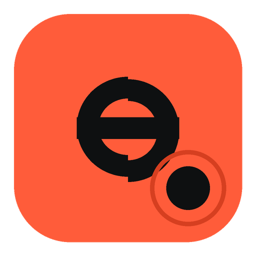

<div align="center">
  
  <h1>Agent Sam</h1>
  <p><em>A local-first desktop agentic workstation for code — and for the rest of the work that happens beside it.</em></p>
</div>

Agent Sam is a single-user desktop app. You open a folder and an agent works inside it — reading files,
writing files, running commands — while every call that changes something waits for your answer.
Conversations, settings, credentials and transcripts stay on your machine, and the models it talks to
are OpenAI-dialect providers: the ones it ships with, or any compatible endpoint you add.

## Features

### The agent loop

- **A streaming tool-calling loop with a consent shield.** Each write and each command waits for your
  approval, and reads are always allowed. The shield has two positions — **Manual** and
  **Auto-approve** — set per conversation, and its own wording names the exception: MCP tools ask
  unless that server's own auto-approve is on.
- **Decisions are answered one at a time.** A turn's calls run in the order the model wrote them, and
  the walk stops at the first call that needs a decision — calls queued behind an undecided one
  neither run nor record an outcome.
- **A step budget with bounded auto-continue.** A turn that stops mid-plan is picked back up rather
  than left hanging, for a bounded number of segments, and every seam is marked on screen so you can
  see that the machine kept going and why.
- **Turn-end cause cards.** A turn that ends without a usable answer says what ended it, and the card
  carries the way to resume from there.
- **A plan checklist** that tracks the steps a turn declared, by status rather than by colour.
- **Edit-and-resend, and regenerate.** Rewrite a message you already sent, or ask for the reply again
  in place of the one you have.

### Conversations

- **A project-grouped session list.** Conversations sit under the folder they are about, with headers
  you can put away; search, rename, delete and export (Markdown or JSON) are on the rows.
- **The workspace root follows the session.** Opening a conversation switches the open folder to the
  one it remembers, and a switch is refused while a decision is pending rather than silently applied.
- **Per-session provider, model and consent.** The model and the auto-approve shield are yours to
  change at any point in a conversation; both are remembered with it.
- **A home screen** with recent projects, a folder picker, and three starter prompts — the prompts swap
  with the Buddy you picked.

### The workspace

- **Explorer and a guarded editor.** A file tree over the open folder, and an editor that remembers the
  modification time it read: if something else writes the file before you save, the save is refused as
  a conflict instead of discarding a version, and overwriting takes a second, deliberate confirmation.
  Read mode has syntax highlighting and line numbers.
- **Viewers beside it.** A markdown preview, a spreadsheet grid you can edit, and an image viewer —
  each a resident of the right rail, each expandable over the chat column.
- **A git panel.** Repository status, current branch, recent log and per-file diffs, with staging,
  unstaging, commit, discarding worktree changes and branch checkout.
- **A bottom terminal.** A real shell in the workspace — PowerShell on Windows, bash elsewhere —
  rendered with xterm.js, docked under the conversation and opened from the title bar. The shell is one
  persistent process per folder, so its scrollback and its `cd` survive the panel being put away. The
  working directory is validated to stay inside the open folder.

### Extension points

- **Skills, with per-conversation activation.** Skills are discovered in four tiers — the project's own
  folder, the user's, and two `.agents` compatibility folders this app reads but never writes. A name
  collision resolves to the higher tier and the loser is dropped rather than offered beside the winner,
  an unreadable file is reported next to the skills that did load, and at most ten may be active in a
  conversation at once.
- **MCP servers, with trust scopes.** Stdio servers declared in user and project configuration are
  listed, started, and trusted one at a time. The command, arguments, directory and environment are what
  a server's permission is really about, so that configuration is hashed when you trust it: a server
  whose file changed since then refuses to start, and a server nobody trusted never runs. Auto-approval
  is granted per server.

### Models and providers

- **Predefined and custom providers.** DeepSeek, OpenRouter, OpenCode, OpenAI and Anthropic ship as
  rows you bring a key to; any server speaking the OpenAI `chat/completions` dialect can be added with a
  base URL, a display name, a key and its models. Keys are encrypted with the operating system keychain
  and never leave the main process, and a provider's model catalogue can be fetched and the models you
  want switched on.
- **Per-model declarations.** Image support (the switch that decides whether the composer may attach a
  picture for that model), pricing for input, cache hits and output, and a context-window override are
  all declared per model — the same row, three facts.

### What a conversation costs

- **An Overview resident** with four tiles that follow the conversation on screen: **Tokens** (prompt and
  completion), **Cost** priced at the rates the provider is declared with — a cache hit at what a cache
  hit costs — **Cache** as the share of the prompt served from cache, and **Turns**.
- **A context-window card.** Nesting, the estimate for the next request and a breakdown by category, a
  health pill, and the compact-point marker drawn against the fill. Nothing in this build compacts on its
  own, and the card says so rather than implying it will act.
- **A Context settings section** where the compact point is a preference and a window belongs to a model.

### Attachments

- **Images in the composer, as chips.** Paste or drop a picture and it appears as a chip with a live
  thumbnail; a sent attachment becomes a tile in the transcript. The vision capability gate refuses an
  attachment for a model that is not declared to read images, and says which model that is.

### Buddies

- **Buddies are persona bundles, not presets.** A Buddy is a record: a role prompt, the skills it turns
  on, the MCP servers it may use, and the defaults it seeds. Three ship built in — **Writer / Editor**,
  **Study Tutor** and **Analyst** — and you can write your own in the editor, where a draft is checked
  by the same rule the store writes it with.
- **The header Select carries the identity.** The default identity comes first, then every Buddy that is
  switched on. The choice is per conversation and locks at the first send, because before it a choice can
  still change and after it a record cannot; the model and the shield beside it stay live.
- **A Buddy cannot grant itself anything.** Its server list is read as an intersection with what you
  have trusted and left on — a ceiling, never a grant — and the role prompt is injected into its turn.
  Home's starters swap with the choice.

### Appearance and layout

- **Five theme palettes in light and dark.** Crimson, Ocean, Forest, Amber and Violet, each a complete
  palette. A brightness control moves a theme's surfaces together without disturbing hue, and every
  theme's text is checked against its own surfaces for a WCAG contrast floor at every brightness step.
- **Resizable panels with layout memory.** Separator drags are remembered per window state — a windowed
  layout and a maximized one are separate sets — and the bottom panel keeps its own height in each.
- **A collapsible drawer and a dockable right rail.** The rail collapses the secondary panel; the right
  rail docks one resident at a time beside the conversation — **Code**, **Preview**, **Overview** and
  **Tools** — and at launch nothing is docked, so the conversation gets the column.

## Tech stack

- **Electron** — the desktop shell, and a main process that owns the file system, the shell, the
  network, the model calls and the MCP servers. Nothing in the renderer touches the disk directly.
- **React 19 + TypeScript** — the renderer, in `app/`.
- **Vite** via electron-vite — the dev server with hot reload, and the production build.
- **Tailwind CSS + shadcn-style primitives** — every component and every style. Colour lives in the
  theme token stylesheet rather than in per-component files, and no second CSS framework is present.
- **Zustand**, under electron-conveyor's `defineStore` — the cross-window stores are main-owned and
  mirrored live into every window, and the renderer keeps its own small stores for UI-only state.
- **electron-conveyor** — typed IPC and cross-window state in three layers: `conveyor/modules/` for
  main-process logic, `conveyor/protocol/` for the pure rules both sides share, and `conveyor/stores/`
  for the state main owns.
- **Vitest + Testing Library + jsdom** for the DOM suites, and a node runner that bundles the protocol
  and main-module suites with esbuild and executes them under plain node.
- **electron-builder** for packaging.

## Getting started

Prerequisites: Node.js and npm. The development workflow is cross-platform; the installer this turn is
built and verified on Windows.

```shell
git clone https://github.com/vipinks/agent-sam.git
cd agent-sam
npm install
npm run dev
```

`npm run dev` opens the workstation with hot reload. `npm start` builds and launches the app as it will
ship (`electron-vite preview`).

Application data lives under the platform's app-data directory — `%APPDATA%\era` on Windows, and the
equivalent on macOS and Linux. Settings, encrypted provider keys, conversation transcripts and the
mirrored store files all resolve there, and that directory name is a storage contract rather than
branding: moving it would orphan credentials that cannot be decrypted anywhere else.

## Repository layout

```text
agent-sam/
├── app/                     the renderer (React)
│   ├── app.tsx              the app root
│   ├── components/
│   │   ├── ui/              shadcn-style primitives
│   │   └── workbench/       rails, panels, composer, viewers, settings
│   └── shell/               title bar, window frame, theme controls
├── conveyor/                the IPC bridge
│   ├── modules/             main-only logic: files, shell, providers, MCP, git, sessions
│   ├── protocol/            pure rules both sides share: consent, trust, plans, pricing
│   ├── stores/              main-owned state every window mirrors
│   ├── router.ts            the whole IPC surface, registered in one place
│   └── client.ts            the typed client the renderer consumes
├── lib/
│   ├── main/                the Electron main process
│   └── preload/             the bridge, configured by conveyor
├── resources/build/         icons, and the macOS entitlements plist
├── testing/                 DOM wiring suites (Vitest + Testing Library)
├── tests/                   node suites, their stubs and their runner
├── electron-builder.yml     packaging
└── package.json
```

`conveyor/router.ts` is the boundary: the renderer imports only `type AppRouter` from it plus the typed
`conveyor` client, and nothing under `app/` may import `fs`, `path`, `child_process` or `electron`. If
the renderer needs the disk, it is a query or a command in a module.

## Testing

The test surface is the six gates below, run together on the final tree:

| Script                   | What it runs                                        |
| ------------------------ | --------------------------------------------------- |
| `npm run test:node`      | The Node suites, bundled with esbuild.              |
| `npm run test:dom`       | The DOM suites, under Vitest and jsdom.             |
| `npm run typecheck`      | `tsc --noEmit` over both the node and web projects. |
| `npm run lint:check`     | ESLint over the whole repository.                   |
| `npm run format:check`   | Prettier over the whole repository.                 |
| `npm run vite:build:app` | The production build.                               |

`test:node` drives the protocol and main-module suites — the agent loop, consent, plans, auto-continue,
sessions, MCP, skills, providers, pricing and the terminal — with Electron stubbed so no suite touches
real app data. `test:dom` covers the wiring that only exists in a DOM: hooks and components, and whether
the wiring calls the right thing.

## Packaging

```shell
npm run build:win
```

That builds the app and then packages it with electron-builder. For Windows it produces two artifacts:

- `agent-sam-1.4.0-setup.exe` — an NSIS installer, per-user, with the installation directory offered
  rather than forced, and a desktop shortcut.
- `agent-sam-1.4.0-win.zip` — the same app as a portable archive.

macOS (`npm run build:mac`, a `.dmg`) and Linux (`npm run build:linux`, an AppImage) targets are
configured alongside it; both are unverified this turn. The Windows build is **unsigned**, so
SmartScreen will warn on the first run of the installer. `resources/` ships unpacked next to the asar
because the main process reads its icons off disk.

## Versioning

`v1.0.0` is the baseline — everything through the work that made this app what it is. `v1.1.0` adds
**Buddies** and the **Agent Sam** rebrand: the product's identifiers move from `sam-ai` to `agent-sam`
and it ships a new logo. A release names the work since the last one, so the current version is the
record of the last phase rather than a count of features. See [CHANGELOG.md](CHANGELOG.md) for the entry
each change shipped under.

## Development

[AGENTS.md](AGENTS.md) and [CLAUDE.md](CLAUDE.md) are the governing documents: the architecture and
product laws, and the boilerplate's own technical reference. Read both before writing code. The house
style is in the `code-style` skill.

Operations that could destroy work — a force-push, a recursive delete, a publish — are gated by a
reviewer component: each such command is approved on its own before it runs, and a refusal is a hard stop
rather than an obstacle to route around. Agent Sam's own consent gate is the same discipline applied to
the agent.

## Based on

Agent Sam is built on [guasam/electron-react-app](https://github.com/guasam/electron-react-app), a
minimal Electron + React + TypeScript starter kit built around electron-conveyor. The boilerplate
supplied the shell, the IPC bridge and the build pipeline; the agentic workstation on top of it is this
project's own work.

## License

MIT — see [LICENSE](LICENSE).
